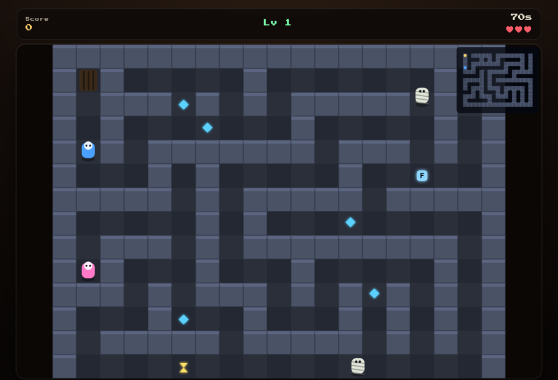

# Castle 🏰🕯️

> A top-down maze **chase & rescue** — you're lost in a haunted castle. Dodge the mummies, grab the key, rescue your friend and escort them to the exit before the timer runs out.

[](https://danmat.github.io/Castle/)
&nbsp;


<p align="center">
  
</p>

## What is it?

The original Castle was a little Akihabara-engine maze game. This is a ground-up
rebuild in **dependency-free vanilla JavaScript** on a plain canvas that keeps
the heart of it — run through a castle, dodge the mummies, find your friend —
and layers on a full arcade loop: **8 generated levels**, torchlight fog, keys,
power-ups, spike traps, a **rescue-and-escort** objective and an online
leaderboard. All art is drawn procedurally (no image assets).

## How to play

- 🎮 **Move** with WASD / arrow keys (or drag on touch). The **camera follows you**.
- 👻 **Mummies, bats and guards** chase you — one touch costs a life (you have 3).
- 🗝️ Grab the **key**, find and **rescue your friend**, then **escort them to the glowing exit** before time runs out.
- 💎 Collect **gems** for score (chain them for a **combo**) and **⏳ hourglasses** for more time.
- ⚡ **Power-ups**: *Freeze* stops the mummies, *Sprint* speeds you up, *Torch* widens your view.
- ⚔️ Dodge **spike traps**, and lean on the **minimap** to navigate.

## Features

- 🧩 **8 escalating levels** — each a freshly generated maze (endlessly replayable).
- 🕯️ **Torchlight / fog-of-war** on the darker levels for real "lost in a castle" tension.
- 👥 **Enemy variety** — shambling mummies (chasers), fast bats, patrolling guards.
- 🤝 **Rescue & escort** — your friend follows your trail once found.
- 🏆 **Online leaderboard** (time + treasure + no-hit bonuses) with retro initials entry.
- 🕹️ Keyboard + touch, fully responsive.

## High scores

The leaderboard uses your browser's **localStorage** out of the box and shares
an online board across all of these games via a free **Supabase** project. See
[`docs/supabase.sql`](docs/supabase.sql) for the schema and
[`js/config.js`](js/config.js) for where the project URL + public key go — the
board is namespaced by `gameId`, so Castle's scores are separate.

## Play locally

It's a static site — no build step:

```bash
git clone https://github.com/DanMat/Castle.git
cd Castle
python3 -m http.server 8000   # then visit http://localhost:8000
```

## How it works

| File | Responsibility |
| --- | --- |
| `js/game.js` | Canvas engine: maze generation, camera, movement/collision, chasing-enemy pathfinding (BFS), fog, items, escort, HUD, state machine. |
| `js/levels.js` | Pure-data level parameters (size, enemies, timer, torch radius, theme). |
| `js/leaderboard.js` | Reusable high-score store (Supabase REST + localStorage fallback). |
| `js/config.js` | Supabase URL/key and game id. |

## Credits

Rebuilt in vanilla JavaScript from the original Akihabara-engine version.

## License

[MIT](LICENSE) © DanMat
